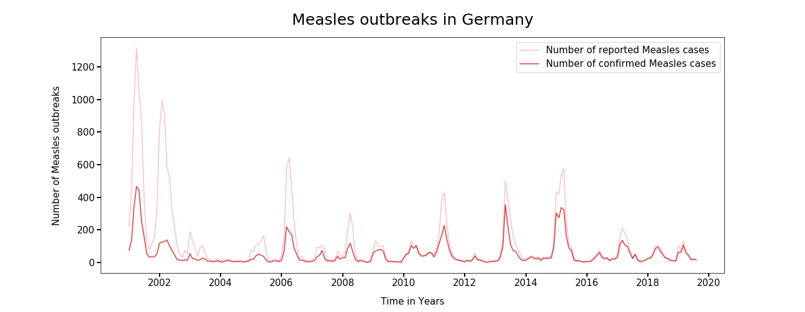
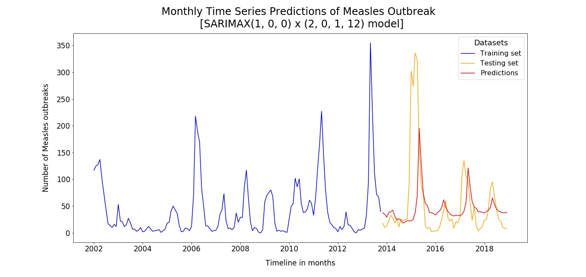
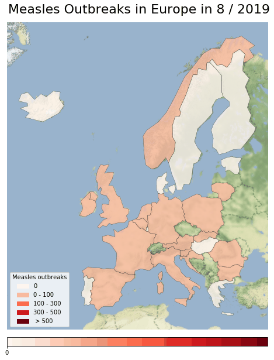

# Measles Outbreaks In European Countries 
---

_Author: Preeya Sawadmanod_ 

## Table of Contents 

* [Problem Statement](#Problem-Statement)
* [Executive Summary](#Executive-Summary)
* [Datasets](#Datasets)
* [Modeling](#Modeling)
    - [Evaluation of Model](#Evaluation-of-Model) 
* [Conclusion](#Conclusion)
    - [Limitations](#Limitations) 
* [Next Steps](#Next-Steps)

## Problem Statement 

The European Centre for Disease Prevention and Control (ECDC) was established in 2005. It is an EU agency aimed at strengthening Europe's defenses against infectious diseases. The core functions cover a wide spectrum of activities such as surveillance, epidemic intelligence, public health training, international relations, health communication, and etc. One interesting function is the vaccine-preventable diseases such as Measles and Rubella. 

Measles is an acute, highly contagious viral disease capable of causing epidemics. Infectivity is close to 100% in susceptible individuals and in the pre-vaccine era measles would affect nearly every individual during childhood. Immunization has dramatically reduced the incidence of measles in Europe but despite overall high immunization coverage, measles continues to cause frequent outbreaks. Globally, measles remains a leading cause of childhood deaths and an estimated 160,000 children die each year from complications of the disease. 

By looking at historical surveillance data in the European countries, can we build a time series model and predict when the next Measles outbreaks would most likely occur? The objective is to detect outbreaks earlier and aim to ensure timely responses to take appropriate public health measures. It is important detect outbreaks early on, especially since measles is a vaccine-preventable disease and childhood deaths can often be prevented. The goal of this project to develop a predictive model to forecast Measles outbreaks and in like every time series models, we can use mean squared error to evaluate our model.

## Executive Summary 

The ECDC publishes a monthly surveillance report on measles and rubella data submitted by the 30 European Union/European Economic Area (EU/EEA) countries in the ECDC Surveillance Atlas of Infectious Diseases. The routine disease data are submitted on a monthly basis by 30 EU/EEA countries and the data for this project was collected through the Surveillance Atlas of Infectious Diseases through the following [link](https://www.ecdc.europa.eu/en/measles/surveillance-and-disease-data/atlas). 

After obtaining the [CSV files](https://github.com/Preeya0225/capstone_project/tree/master/data), the data was cleaned by checking for duplicates, missing values and different data types. The cleaning process can be found in this [Notebook](./code/1_data_cleaning.ipynb). After the cleaning process, the data was then saved into a new CSV file.

In [Exploratory Data Analysis Notebook](./code/2_eda.ipynb) the Measles outbreaks data was analyzed by looking into each specific country of the 30 EU/EEA countries. During EDA shown in the plot below, Measles outbreaks in Germany occurred most frequently from 2000 - 2019 and resulted in the most suited country for predicting Measles outbreaks over time. Selecting Germany as our target country for predictions to further continue to our next step, Modeling.

During [Modeling](./code/3_modeling.ipynb) the data was preprocessed and then used to predict outbreaks in Germany with an ARIMA and a SARIMAX model. The SARIMAX model, also known as Seasonal Autoregressive Integrated Moving Average with eXogenous regressors model, resulted in approx. XXXX Mean Squared Error, which was the best model with the minimum Mean Squared Errors compared to our other models. 

In conclusion, utilizing our vaccination records and historical data from measles cases, we were able to obtain a model predicting Measles Outbreaks in Germany. 

## Datasets 

|Name|Descriptions|
|---|---|
|[ECDC_surveillance_data_Measles_reports.csv](./data/ECDC_surveillance_data_Measles_reports.csv)| This datasets includes Measles's Notification rate, Reported cases of Measles, Confirmed reported cases of Measles and Number of Deaths caused by Meales in 30 European Countries from 1999 - 2018.|
|[ECDC_surveillance_data_Measles.csv](./data/ECDC_surveillance_data_Measles.csv)| This datasets includes Vaccination rate of first and second dosage for Measles prevention in 30 different European Countries from 1999 - 2018.| 
|[measles.csv](./data/measles.csv)| This dataset is the combined and cleaned version of ECDC surveillance datasets including Measles outbreaks and Vaccination records. 

## Modeling 

In our time series model, the SARIMAX (1,0,0) X (2,0,1,12) model in the plot below shows our training set, testing set and predictions of reported confirmed cases of Measles outbreaks. The Mean Squared Error (MSE) resulted in X value. This model had the least MSE compared to other models and can be concluded to be our best model.

### Evaluation of Model 

According to the US National Library of Medicine National Institutes of Health, from beginning 2014 to 2015 outbreaks in Germany was caused by asylum seekers and spread among the insufficiently vaccinated resident population in Berlin (More information on resource click [here](https://www.ncbi.nlm.nih.gov/pubmed/28857043). As we can see in the modeling plot above Measles cases around 2014 and 2015 were the highest in the history of Measles outbreaks in Germany. Our SARIMAX model was not able to fully capture the intensity of outbreaks during 2015. One reason why our model was not able to capture the outbreak could have been caused due to drastic change of population growth. According to recent data published by the UNHCR, Germany is home to the most refugees by far in Europe - 1.4 million in total by the end of 2019 (more information on resource click [here](https://www.statista.com/chart/14494/germany-is-home-to-the-most-refugees/). This change of population could have affected our vaccination rate significantly. 

Overall, our model did capture most of the outbreaks in 2016, but not in 2017 or 2018. This model does require additional improvements; however, we were able to successfully forecast measles outbreaks using its relationship with vaccination coverage with an MSE of 5500. This value was the lowest of all our time series models and can be considered as our best model so far. The MSE is still relatively high, showing that our model can still be more improved. 

## Conclusion 

Overall, by looking at historical surveillance data in European countries, we were able to create a time series model predicting Measles outbreaks in Germany. This model could be very beneficial for early Measles outbreaks warning in the future. However, there are many limitations with this model, which are listed below in the limitation section. 

### Limitations

#### Targeting Country
One biggest limitation in our model is the fact that we targeted one specific country, where outbreaks frequently occurred over time. For instances, this model will not be able to capture outbreaks in other country such as Italy or Romania, where outbreaks don't occur frequently. However, these two countries have the highest number of Measles outbreaks in history of Europe. Additionally, Austria showed many outbreaks and it is the neighboring country of Germany. Since there is open border rule in Europe, where traveling from one country to a neighboring country is quite easy, diseases are easily spread. Measles is highly contagious and air-born; therefore, it can be concluded that outbreaks in one country puts neighboring countries at more risk of outbreaks. We are not able to capture this relation in our model.

#### Accurate Vaccination Data
One crucial information we need for our model is the most accurate vaccination records. 

> To achieve herd immunity for measles at least 90-95% of the population need to be vaccinated (More information on resource and herd immunity click [here](https://www.ovg.ox.ac.uk/news/herd-immunity-how-does-it-work))

For children, and in particular young children and Newborns, are at the highest risk of Measles diseases and need to be protected by herd immunity if they are not vaccinated. If the vaccination rate drops below the threshold of herd immunity, many people will be at risk. For instances, Newborn babies who are too young to be vaccinated totally depend on herd immunity. Having accuracte vaccination records is crucial for our model. We only had the overall yearly vaccination rate from the entire country. Therefore, we took the yearly rate and converted it into the monthly rate for our model. This is one big limitation in our model as vaccination rate yearly might not be as accurate to represent every month. Vaccination rate might increase or decrease monthly. 

## Next Steps 

As already mentioned in conclusion, one way to improve our prediction model is to include outbreaks in neighboring country. Below is a Choropleth map of Measles outbreaks from 2018 to 2019. We can see that in most cases that if there is a high number of outbreaks in one country, neighboring countries also are experiencing outbreaks. 

  

One way to approaching this problem is using Spatial Data Analysis (more information [here](https://geodacenter.github.io/)) GeoDa is designed to facilitate new insights from data analysis by exploring and modeling spatial patterns.

Additionally, by providing real-time data, this model can be used as continent-wide disease surveillance for early warning detections, not just for Germany, but also for other countries in Europe. Obtaining more accurate vaccination rate would be the first step in improving this model.

These are just few examples of how our model can still be improved in the future. 

